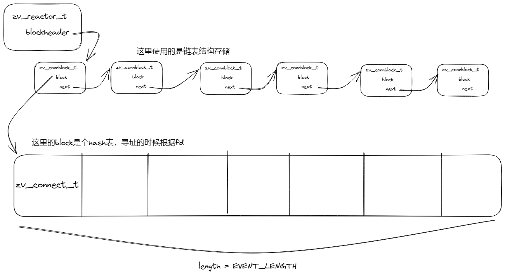

interface.h            #一些可以复用的基础组件，慢慢补充

socket.cpp              #简单的socket服务器程序

#IO复用

select.cpp              #简单应用select的服务器代码
        使用TCP测试工具收发包，将收到的数据包原路返回，测试了同时使用3条TCP连接，任意发送断开连接功能正常。

poll.cpp                #简单的poll服务器代码

epoll.cpp               #简单的epoll服务器代码

写完网络服务器和简单的IO复用之后的一些笔记：
        1、socket初始化，第一个参数：AF_INET(IPv4协议) / AF_INET6(IPv6协议) / AF_UNIX(Unix域协议)，第二个参数：SOCK_STREAM(TCP协议) / SOCK_DGRAM(UDP协议)，非阻塞IO的使用 fcntl().
        2、listen监听：backlog：指定连接队列的最大长度，即在未accept之前能够等待连接的最大数量
        3、epoll_create();  参数原本表示期望监听的文件描述符的个数；参数在新版本的linux中无意义，大于0即可。
        4、epoll_wait();    timeout：-1（一直等待）、 0（立即返回）、>0 (等待一段指定时间，如果时间到期之前有事件触发，立即返回)
        5、epoll_ctl();     第二个参数的选择：EPOLL_CTL_ADD/EPOLL_CTL_DEL/EPOLL_CTL_MOD
        6、select();        参数：要检查的最大文件描述符+1；待检测的可读\可写\异常事件文件描述符；timeout指定超时时间，NULL一直阻塞直到事件触发；0立即返回；timeval结构体的指针指定的时间内等待事件发生。
        7、select用到的关键字：fd_set、FD_ZERO、FD_SET、select、FD_ISSET、FD_CLR
        8、IO多路复用的边缘触发：读写异常事件，从不可读/不可写/无异常状态变为可读/可写/有异常状态时，触发。
        9、IO多路复用的水平触发：当文件描述符上的事件状态为可读可写时会持续通知应用程序，直到处理完毕或者文件描述符再次变为无事件状态。

reactor.cpp             #基于epoll的端口复用reactor框架
        1、虽然用的是.cpp文件，但还是用的C语言写法，简单的把recv到的数据原路send回去
        2、接下来给reactor代码加注释
        3、封装为C++代码库，并快速构建高并发服务器，做简单的TCP收发数据（将收到的数据翻转后原路返回）
    
    框架：
        数据结构的设计：

        记录一下reactor：
                1、一般网路IO处理流程：程序调用某函数，函数执行，程序等待，函数将结果和控制权限返回给程序，程序继续处理。
                2、reactor：是一种事件驱动机制，程序不是主动调用某个API完成处理。当读写事件发生后，reactor再调用对应的API。

协程：用同步的编程方式，实现异步的性能。
        使用NtyCo协程框架
