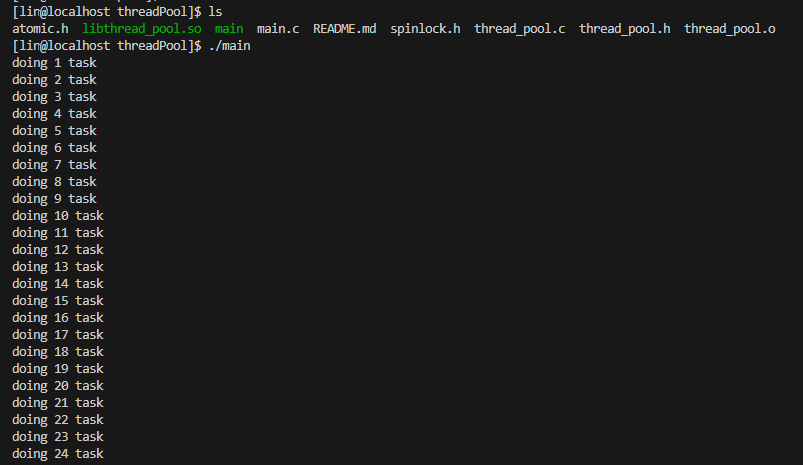

    thread pool         线程池

    1、线程池数据结构设计：
        //任务结构
        typedef struct task_s
        {
            //指向下一个任务，需要注意：这里可以使用struct task_s*,但是用的却是void*，跟后续使用二级指针访问相关.
            void* next;
            //函数指针
            handler_Ptr func;
            //func参数
            void* arg;
        }task_t;

        //任务队列
        typedef struct task_queue_s
        {
            //任务头指针.
            void* head;
            //任务尾指针    --注意这里的void** 二级指针
            void** tail;
            //当前是否是阻塞的
            int block;
            //自旋锁
            spinlock_t lock;
            //互斥锁
            pthread_mutex_t mutex;
            //条件变量  互斥锁的条件变量
            pthread_cond_t cond;
        }task_queue_t;

        //线程池数据结构
        struct threadpool_s
        {
            //任务队列
            task_queue_t* task_queue;
            //标记      -- 是否让整个线程池退出
            atomic_int quit;
            //线程数量
            int thread_count;
            //数组指针  -- 维持线程
            pthread_t* threads;
        };

    2、线程池接口设计
        暴露给用户的接口：
            // 线程池创建接口        -- 需要输入线程数量
            threadpool_t* threadpool_create(int thread_count);
            // 线程池任务终止接口
            void threadpool_terminate(threadpool_t* pool);
            // 抛入任务接口
            int threadpool_post(threadpool_t* pool, handler_Ptr func, void* arg);
            // 线程池等待接口
            void threadpool_waitdone(threadpool_t* pool);
        
        内部使用的接口：
            // 使用static 修饰函数，避免名字冲突，只在当前.c中可见
    
    3、代码实现
        thread_pool.c   thread_pool.h
        其中：使用了github上开源的一个原子操作代码：atomic.h、spinlock.h
    
    4、编译动态库：
        gcc thread_pool.c -c -fPIC
            由于GCC版本太低导致编译器识别不了stdatomic.h文件，uodate GCC后重新编译
        gcc -shared thread_pool.o -o libthread_pool.so -I./ -L./ -lpthread
    
    5、测试、应用
        include thread_pool.h & link libthread_pool.so
        main.c
        编译：gcc -Wl,-rpath=./ main.c -o main -I./ -L./ -lthread_pool -lpthread

